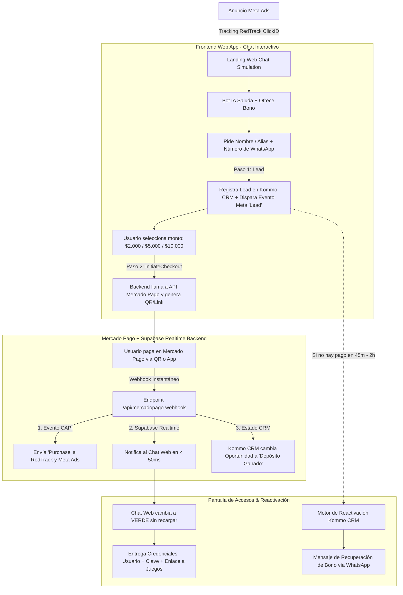
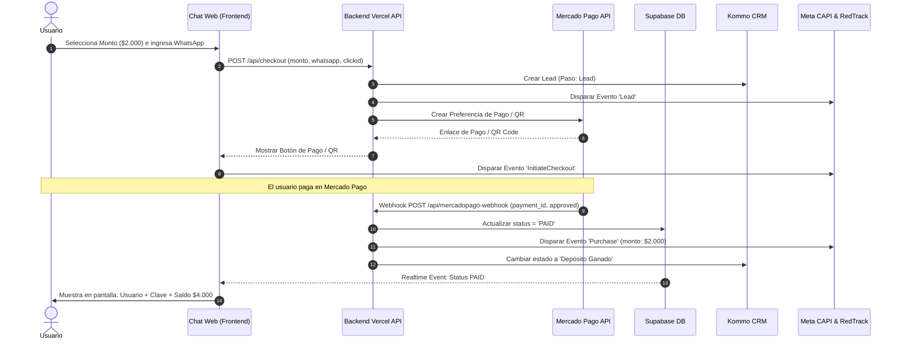

# 📐 Blueprint Arquitectónico: Agente IA Web "Cajero Autónomo"
## Embudo Web Self-Closing 100% Automatizado sin Dependencia de APIs de WhatsApp
### Stack: Supabase + Next.js / Vercel Serverless + Mercado Pago API + Gemini AI + Kommo CRM + RedTrack

---

## 🎯 1. Resumen Ejecutivo y Objetivo

El **Agente IA Web "Cajero Autónomo"** es una aplicación web interactiva que simula la interfaz oficial de WhatsApp Web/Mobile y permite que el usuario complete **todo el proceso de carga y recepción de su cuenta de casino directamente en la web**, sin necesidad de abrir la aplicación de WhatsApp ni interactuar con un asesor humano.

### 🚀 Beneficios Clave:
- **Cierre Instantáneo (30 - 60 segundos):** Eliminación total del tiempo de espera de un asesor humano.
- **Disponibilidad 24/7:** Opera de forma ininterrumpida en madrugadas y horarios de alto tráfico de apuestas.
- **Ahorro Operativo ($0 Comisiones de Closers):** Cierre automático en pantalla.
- **Trazabilidad 100% Precisa:** Disparo automático de eventos Meta Pixel & S2S CAPI (`Lead`, `InitiateCheckout`, `Purchase`) con el `ClickID` de RedTrack.
- **Captura de Respaldo:** El sistema solicita Nombre y WhatsApp **antes** de entregar el CBU/Link de Pago, garantizando que el Lead quede registrado en Kommo CRM para remarketing.

---

## 🏗️ 2. Diagrama de Flujo de Datos y Conversión

---

## 🗄️ 3. Selección de Infraestructura: Supabase vs Cloudflare D1

### 🏆 Opción Elegida: **SUPABASE (PostgreSQL + Realtime Subscriptions)**

| Característica | Supabase (Recomendado) | Cloudflare D1 / KV |
| :--- | :--- | :--- |
| **Notificación de Pago al Chat** | **Realtime Subscriptions:** Cuando Mercado Pago notifica el pago, Supabase actualiza el chat del cliente en **< 50ms** sin refrescar la web. | Requiere polling continuo o servidor WebSocket adicional. |
| **Persistencia de Sesión** | Tablas relacionales con trazabilidad de `clickid`, estado del lead, monto cargado y credenciales. | Adecuado para pares clave-valor, pero más rígido para analítica relacional. |
| **Integración con Next.js / Vercel** | SDK nativo oficial de JavaScript / TypeScript. | Requiere bindings específicos de Cloudflare Workers. |

---

## 💳 4. Flujo Detallado de Pago y Entrega de Accesos

---

## ⏰ 5. Motor de Reactivación a las 2 Horas (Leads Incompletos)

Para garantizar que **ningún Lead se pierda** si el usuario abandona el chat antes de pagar:

### Nivel A: Tab Re-Engagement (En la misma Web)
- **Detección de Inactividad:** Si el usuario minimiza la pestaña por más de 3 minutos, el título del documento cambia dinámicamente:
  `💬 (1) Mensaje del Cajero: Tu bono vence en breve...`
- **Alerta Sonora:** Se emite un tono sutil de notificación de mensaje.

### Nivel B: Reactivación Automatizada a las 2 Horas & Salud de la API de WhatsApp

#### ⚠️ Análisis de Políticas de Meta WhatsApp API (WABA) y Salud del Número:
1. **Regla de Mensajes Inbound vs. Outbound:**
   - Si el cliente **NO inició el chat previamente en la app de WhatsApp** (porque todo el flujo ocurrió en la Web), la ventana de atención gratuita de 24 horas **NO está abierta**.
   - Por normativas de Meta, **ES OBLIGATORIO utilizar una Plantilla Aprobada (HSM Template)** de tipo *Utility* o *Marketing*. No es posible enviar un mensaje libre de texto plano.
2. **Impacto en la Salud de la Línea (Quality Rating):**
   - Si se envía una plantilla de WhatsApp Outbound a usuarios que no la solicitaron explícitamente y algunos presionan *"Reportar Spam"* o *"Bloquear"*, la salud del número bajará de **GREEN 🟢 a YELLOW 🟡 / RED 🔴**, aumentando el riesgo de baneo o restricción del Tier diario de envíos.

#### 🛡️ Las 3 Alternativas Recomendadas para Proteger la Salud del Sistema:

- **Opción 1: SMS Transaccional de Recuperación (100% CERO RIESGO & INMUNE A BANEOS) 🏆**
  - Se envía un mensaje SMS de texto corto a los 45m - 2h a través de Twilio / AWS SNS ($0.008 USD por envío):
    > *"🎰 [Cajero Casino] Hola {{1}}, tu Bono del +100% expira en 30 min. Reanuda tu carga aquí: https://tuweb.com/chat?id={{2}}"*
  - **Ventajas:** No requiere aprobación de Meta, entrega 100% garantizada, 0 riesgo para tus números de WhatsApp.

- **Opción 2: Plantilla Oficial de Meta Tipo UTILITY con Opt-in previo en Web**
  - En el Chat Web, al ingresar el número se incluye la leyenda: *"Al enviar aceptas recibir la clave de tu cuenta y notificaciones de tu saldo por WhatsApp"*.
  - Se utiliza una Plantilla de Utilidad aprobada por Meta:
    > *"Hola {{1}}, tu código de reserva de cuenta {{2}} expira en breve. Puedes reanudar tu carga en el enlace oficial: {{3}}"*

- **Opción 3: Notificación Push Nativa del Navegador (Web Push API)**
  - Si el usuario aceptó notificaciones web, se envía un mensaje push directo a la pantalla de su teléfono o PC sin costo ni uso de APIs externas.

---

## 🛠️ Plan de Implementación por Fases

1. **Fase 1: Configuración de Base de Datos en Supabase**
   - Crear tablas: `chat_sessions` (id, clickid, name, whatsapp, amount, status, created_at).
   - Activar Supabase Realtime en la tabla `chat_sessions`.

2. **Fase 2: Endpoints Serverless en Vercel**
   - `api/postback.js`: Manejador de leads y conversiones.
   - `api/create-preference.js`: Generación de checkout en Mercado Pago API.
   - `api/mercadopago-webhook.js`: Receptor de pagos aprobados.

3. **Fase 3: Frontend Web Chat Interactivo**
   - Integración con el borrador `draft_landing_v2_full_interactive_chat.html`.
   - Conexión con Supabase Client JS para escuchas en tiempo real.

4. **Fase 4: A/B Testing & Medición en RedTrack**
   - Rotación A/B 50-50 contra el embudo tradicional de asesores humanos para comparar CPA y Tasa de Conversión.

---

## 🛡️ 6. Análisis de Seguridad y Blindaje del Dominio contra Baneos de Meta

### ¿Existe Riesgo de Baneo sobre el Dominio Web con este Sistema?
**NO. Al contrario: El riesgo de baneo de dominio disminuye en un 90% a 95% en comparación con el embudo tradicional de WhatsApp.**

#### 🔍 ¿Por qué se banean los dominios en el embudo tradicional de iGaming?
1. **Baneo Cruzado por WhatsApp:** En el embudo tradicional, cuando miles de usuarios entran a un número de WhatsApp que luego es reportado como spam, Meta asocia la URL de la Landing Page que enviaba tráfico a ese número y banea el dominio completo en Meta Business Manager.
2. **Redirecciones Salientes Masivas (`wa.me`):** Los bots de rastreo de Meta (Facebook Crawlers) detectan cuando un dominio solo sirve como "puente" para redirigir masivamente hacia números telefónicos informales.

#### 🛡️ Por qué el Agente Web Autónomo protege y blindará tu Dominio:
1. **Flujo 100% Contenido en el Dominio:** El usuario nunca sale del dominio (`tuweb.com/chat`). Los Crawlers de Meta Ads ven una aplicación web legítima e interactiva con políticas de privacidad claras.
2. **Cero Reportes de Spam en WhatsApp:** Al no enviar mensajes no solicitados de WhatsApp, se elimina el desencadenante #1 de baneos cruzados.
3. **Pasarela de Cobro Encriptada (SSL / Mercado Pago API):** Las transacciones ocurren sobre protocolos HTTPS / SSL seguros con pasarelas oficiales.

#### 📋 Las 4 Reglas de Oro para Blindar 100% el Dominio:
- **Dominio Propio con SSL:** Usar dominios `.com` o `.online` propios con certificado SSL activo (evitar usar subdominios de prueba en pauta activa).
- **Subdominio de Tracking Separado:** Configurar en RedTrack un CNAME de tracking dedicado (ej: `trk.tudominio.com`).
- **Footer de Cumplimiento Meta:** Incluir enlaces obligatorios en el pie de página: `Términos y Condiciones`, `Política de Privacidad`, y badge oficial de `+18 Juegos Responsables`.
- **SMS Transaccional para Recuperación:** Mantener la reactivación a las 2h vía SMS (Twilio) o WhatsApp Utility Aprobado para mantener en cero los reportes.
