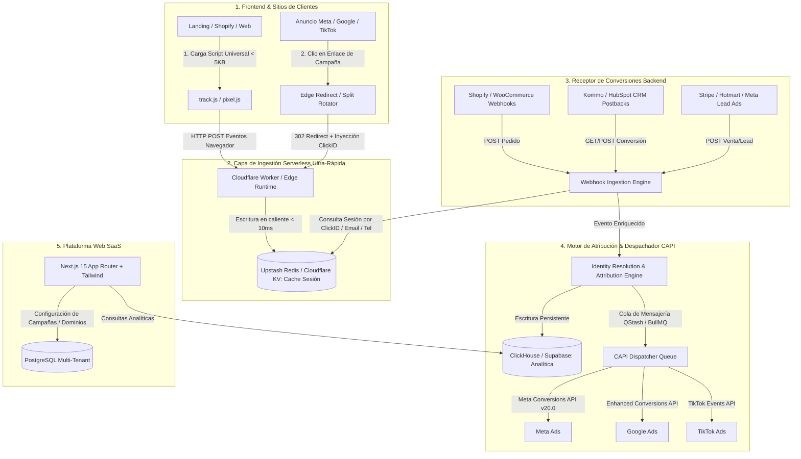

# 🚀 Blueprint Técnico y de Negocio: SaaS de Atribución y Tracking Multicanal
## "OmniTrack AI" — Alternativa Moderna a RedTrack, Hyros y AnyTrack
### Enfoque: E-commerce, Formularios Lead Gen, WhatsApp y CRM para el Mercado Global e Hispano

Este documento contiene el **diseño de arquitectura de software, modelo de datos, componentes técnicos y plan de producto** para construir y escalar una plataforma SaaS multi-inquilino (*Multi-Tenant*) de atribución publicitaria y Server-Side Tracking.

---

## 🏛️ 1. Arquitectura del Sistema de Alto Rendimiento



---

## 🧩 2. Componentes Principales del SaaS

### Componente 1: Script Universal de Rastreo (`track.js`)
- **Peso:** < 5 KB (sin dependencias).
- **Funcionalidad:**
  - Genera automáticamente un `cid` (*Click ID*) único de 1ª persona si no existe en la URL.
  - Captura `fbclid`, `gclid`, `ttclid`, `utm_source`, `utm_medium`, `utm_campaign`, `utm_content`, `utm_term`.
  - Guarda los datos en `localStorage` y en `Cookie` con bandera `SameSite=Lax` y expiración de 180 días.
  - Escucha automáticamente eventos DOM:
    - Envíos de formulario (`submit`).
    - Clics en enlaces de WhatsApp (`wa.me` o `api.whatsapp.com`) e inyecta el `{clickid}` en el texto del mensaje de forma transparente.
    - Clics en botones de salida (`/click`).

### Componente 2: Motor de Enrutamiento y Split URL (Rotador A/B)
- Ejecutado en el **Edge (Cloudflare Workers)** con latencia < 15ms.
- Permite crear enlaces de campaña como `https://trk.tusaas.com/cmp_123456`.
- Soporta:
  - **Rotación por pesos:** Lander A (50%) vs Lander B (50%).
  - **Targeting por dispositivo:** Móvil vs Desktop.
  - **Geo-targeting:** Filtrar por país/ciudad.
  - **Bot Filtering:** Descartar bots de revisión de Meta y Google para no ensuciar las estadísticas.

### Componente 3: Motor Universal de Webhooks & Integraciones
- Endpoint universal de recepción: `https://api.tusaas.com/v1/webhooks/{workspace_id}/{source}`.
- Conectores nativos listos para usar:
  - **Shopify:** Ingestión de `orders/paid` y `checkouts/create`.
  - **WooCommerce:** Ingestión de `order_created` y `order_completed`.
  - **CRMs (Kommo, HubSpot, Zoho, ActiveCampaign):** Recepción de postbacks por cambio de etapa.
  - **Pasarelas (Stripe, Mercado Pago, Hotmart, PayPal).**
  - **Meta Lead Ads (Formularios Nativos de Facebook/Instagram):** Webhook directo para capturar leads instantáneos.

### Componente 4: Motor de Resolución de Identidad y Atribución
- Cuando entra una conversión (vía Webhook o Postback), busca coincidencia usando múltiples llaves en cascada:
  1. **Nivel 1:** `click_id` exacto.
  2. **Nivel 2:** Email hasheado en SHA-256 (`em`).
  3. **Nivel 3:** Teléfono hasheado en SHA-256 (`ph`).
  4. **Nivel 4:** `fbp` (Cookie de Meta) + Dirección IP + User Agent.
- **Modelos de Atribución calculados:**
  - *First-Click* (Primer Clic)
  - *Last-Click* (Último Clic)
  - *Linear* (Lineal)
  - *Data-Driven / AI Assisted* (Atribución ponderada multi-toque)

### Componente 5: Despachador CAPI Multicanal Resiliente
- Gestiona colas de reintentos automáticos (*Exponential Backoff*) si Meta o Google tienen caídas temporales.
- Deduplicación automática mediante `event_id`.
- Envío en tiempo real (< 2 segundos) para que el algoritmo publicitario optimice de inmediato.

---

## 🗄️ 3. Modelo de Base de Datos (Esquema Multi-Tenant)

```sql
-- 1. Organizaciones / Clientes
CREATE TABLE organizations (
    id UUID PRIMARY KEY DEFAULT gen_random_uuid(),
    name VARCHAR(255) NOT NULL,
    plan_tier VARCHAR(50) DEFAULT 'starter', -- starter, pro, agency
    stripe_customer_id VARCHAR(255),
    created_at TIMESTAMP WITH TIME ZONE DEFAULT NOW()
);

-- 2. Dominios Personalizados (Custom CNAMEs)
CREATE TABLE custom_domains (
    id UUID PRIMARY KEY DEFAULT gen_random_uuid(),
    organization_id UUID REFERENCES organizations(id) ON DELETE CASCADE,
    domain VARCHAR(255) UNIQUE NOT NULL, -- ej: trk.cliente.com
    ssl_status VARCHAR(50) DEFAULT 'pending', -- pending, active, error
    cloudflare_hostname_id VARCHAR(255),
    created_at TIMESTAMP WITH TIME ZONE DEFAULT NOW()
);

-- 3. Campañas de Tracking
CREATE TABLE campaigns (
    id UUID PRIMARY KEY DEFAULT gen_random_uuid(),
    organization_id UUID REFERENCES organizations(id) ON DELETE CASCADE,
    name VARCHAR(255) NOT NULL,
    traffic_channel VARCHAR(50) NOT NULL, -- facebook, google, tiktok, organic
    custom_domain_id UUID REFERENCES custom_domains(id),
    status VARCHAR(20) DEFAULT 'active',
    created_at TIMESTAMP WITH TIME ZONE DEFAULT NOW()
);

-- 4. Landings / Páginas (para Split Testing)
CREATE TABLE landers (
    id UUID PRIMARY KEY DEFAULT gen_random_uuid(),
    campaign_id UUID REFERENCES campaigns(id) ON DELETE CASCADE,
    name VARCHAR(255) NOT NULL,
    url TEXT NOT NULL,
    weight INT DEFAULT 100, -- Peso para rotación A/B (ej: 50)
    created_at TIMESTAMP WITH TIME ZONE DEFAULT NOW()
);

-- 5. Registro de Clics y Sesiones (Base de Datos Analítica ClickHouse / Hypertable)
CREATE TABLE raw_clicks (
    click_id VARCHAR(64) PRIMARY KEY,
    organization_id UUID NOT NULL,
    campaign_id UUID NOT NULL,
    lander_id UUID,
    ip_address VARCHAR(45),
    user_agent TEXT,
    country VARCHAR(10),
    city VARCHAR(100),
    device_type VARCHAR(20),
    os VARCHAR(50),
    browser VARCHAR(50),
    fbclid TEXT,
    gclid TEXT,
    fbp VARCHAR(100),
    fbc VARCHAR(255),
    utm_source VARCHAR(100),
    utm_medium VARCHAR(100),
    utm_campaign VARCHAR(100),
    utm_content VARCHAR(100),
    utm_term VARCHAR(100),
    created_at TIMESTAMP WITH TIME ZONE DEFAULT NOW()
);

-- 6. Registro de Conversiones (Eventos de Backend)
CREATE TABLE raw_conversions (
    id UUID PRIMARY KEY DEFAULT gen_random_uuid(),
    click_id VARCHAR(64) REFERENCES raw_clicks(click_id),
    organization_id UUID NOT NULL,
    event_type VARCHAR(50) NOT NULL, -- Lead, InitiateCheckout, Purchase, etc.
    event_value NUMERIC(12, 2) DEFAULT 0.00,
    currency VARCHAR(10) DEFAULT 'USD',
    source_platform VARCHAR(50), -- shopify, kommo, woocommerce, webhook
    capi_meta_status VARCHAR(20) DEFAULT 'pending', -- sent, failed, skipped
    capi_google_status VARCHAR(20) DEFAULT 'pending',
    raw_payload JSONB,
    created_at TIMESTAMP WITH TIME ZONE DEFAULT NOW()
);
```

---

## 💻 4. Stack Tecnológico Recomendado

| Capa | Tecnología | Justificación |
| :--- | :--- | :--- |
| **Frontend & Dashboard** | **Next.js 15 (React 19, App Router) + Tailwind CSS** | SSR rápido, componentes modernos y panel responsivo. |
| **Gráficos & Analítica UI** | **Tremor UI / Recharts** | Gráficas financieras y de ROAS listas para SaaS. |
| **Capa de Ingestión Edge** | **Cloudflare Workers (TypeScript)** | Latencia < 15ms global, escalabilidad infinita y costo casi nulo. |
| **Cache de Sesiones Calientes** | **Upstash Redis / Cloudflare KV** | Búsqueda ultrarrápida del `click_id` al llegar webhooks. |
| **Base de Datos Analítica** | **ClickHouse (o Supabase PostgreSQL)** | Consultas de millones de eventos en milisegundos para los reportes. |
| **Colas de Tareas (CAPI)** | **Upstash QStash o BullMQ** | Despacho asíncrono y reintentos automáticos a Meta/Google. |
| **Dominios SSL de Clientes** | **Cloudflare for SaaS (SSL for SaaS)** | Permite que cada cliente conecte su subdominio (`trk.suweb.com`) con SSL automático vía API. |
| **Pagos y Facturación** | **Stripe Billing** | Cobro recurrente de suscripciones con límites por eventos. |

---

## 💰 5. Modelo de Precios y Monetización (Pricing Tiers)

Estrategia agresiva para ganar cuota de mercado frente a RedTrack ($149+) e Hyros ($500+):

| Plan | Precio | Límite de Eventos / Clics | Funcionalidades |
| :--- | :--- | :--- | :--- |
| **Starter** | **$39 USD / mes** | Hasta 25.000 eventos/mes | 1 Dominio, Meta CAPI + Google CAPI, Webhooks de CRM y Shopify. |
| **Growth / Pro** | **$89 USD / mes** | Hasta 100.000 eventos/mes | 3 Dominios, Split URL testing A/B, WhatsApp Link Builder, Atribución Multi-Touch. |
| **Agency / Scale** | **$199 USD / mes** | Hasta 500.000 eventos/mes | Dominios ilimitados, Sub-cuentas para clientes (Workspaces), Marca Blanca (White-Label). |
| **Enterprise** | Custom | > 1.000.000 eventos/mes | Servidor dedicado, soporte prioritario por WhatsApp y SLA 99.9%. |

---

## 🗺️ 6. Hoja de Ruta de Desarrollo (Roadmap de 6 Semanas al MVP)

- **Semana 1-2: Core Engine & Ingestion Worker**
  - Desarrollo del script `track.js` universal.
  - Creación del Cloudflare Worker para captura de clics, generación de `cid` y almacenamiento en Redis/KV.
- **Semana 3: Webhook Engine & Conexión Meta CAPI**
  - Endpoint de recepción de webhooks (Shopify, WooCommerce y formato estándar Postback).
  - Módulo despachador de Meta Conversions API (Graph API) con deduplicación por `event_id`.
- **Semana 4: Dashboard Web & Gestión de Campañas**
  - Panel en Next.js para crear campañas, generar links y configurar tokens de píxeles.
  - Tabla de reportes en tiempo real (Clicks, LP Clicks, Leads, Purchases, ROAS).
- **Semana 5: Split URL Rotator & Integraciones de CRM**
  - Motor de rotación de landings por pesos (50/50).
  - Conector optimizado para Kommo CRM, HubSpot y WhatsApp.
- **Semana 6: Facturación con Stripe, Pruebas Beta y Lanzamiento**
  - Integración de Stripe Checkout y suscripciones.
  - Conectar los primeros 3 a 5 clientes de tu agencia como usuarios beta.
  - Lanzamiento comercial al mercado hispano.
