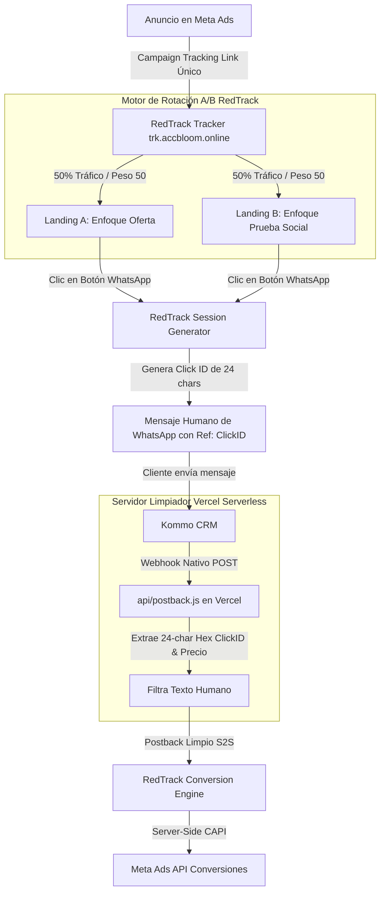

# 📘 Manual de Operaciones Estándar (SOP) & Guía de Implementación
## Creación, Despliegue, A/B Testing (Split URL) y Tracking de Landings
### Stack: RedTrack + Meta Pixel + WhatsApp + Kommo CRM + GitHub + Vercel

Este manual detalla el **proceso secuencial y estandarizado de inicio a fin** para crear, desplegar, rotar mediante **Split URL A/B Testing** y medir con precisión las conversiones de tus páginas de aterrizaje hacia WhatsApp y CRM.

---

## 🏗️ 1. Arquitectura del Flujo de Tráfico y Split Testing



---

## 📐 2. Configuración Universal para Clientes (Fabri, Favio, etc.)

### 🌐 Endpoints Universales de Vercel (Reutilizables para cualquier cliente):

- **Evento Lead (Lead Recibido):**
  `https://sitecreatorbloom.vercel.app/api/postback?type=Lead`
- **Evento InitiateCheckout (Datos de Pago Enviados / CBU Enviado):**
  `https://sitecreatorbloom.vercel.app/api/postback?type=InitiateCheckout`
- **Evento Purchase (Depósito Confirmado con valor dinámico):**
  `https://sitecreatorbloom.vercel.app/api/postback?type=Purchase`

---

## 📊 3. Clientes Configurados y Validados en Producción

### 👤 Cliente 1: Fabri
- **Landing:** `https://sitecreatorbloom.vercel.app/landing_fabri.html`
- **RedTrack Campaign ID:** `6a86230a706cfa38ad712954`
- **Kommo Account:** `suzydiazrojas.kommo.com`
- **Status:** 100% Validado (`Lead`, `InitiateCheckout`, `Purchase`).

### 👤 Cliente 2: Favio
- **Landings:**
  - Versión 1: `https://sitecreatorbloom.vercel.app/landing_fa.html`
  - Versión 2: `https://sitecreatorbloom.vercel.app/landing_fa_v2.html`
- **RedTrack Campaign ID:** `6a850eede10af64050c0ae2d`
- **Kommo Account:** `suportecassino365.kommo.com`
- **Status:** 100% Validado (`Lead`, `InitiateCheckout`, `Purchase`).

---

## 🎯 4. Regla Estándar de Tracking: Meta Pixel Frontend vs. S2S CAPI Backend

### 🚨 Regla Obligatoria para Evitar Disparidad de Conversiones
1. **Frontend (Navegador / HTML):**
   - En el evento `onclick` de los botones de WhatsApp (tanto principal como barra flotante), **ÚNICAMENTE** se debe disparar el evento `Contact`:
     ```html
     onclick="if(typeof fbq === 'function') { fbq('track', 'Contact'); }"
     ```
   - **NUNCA** incluir `fbq('track', 'Lead')` en el frontend, ya que esto cuenta cada clic en la web como un lead, generando falsos positivos cuando el usuario no envía el mensaje en WhatsApp.

2. **Backend (Server-Side / S2S CAPI):**
   - El evento `Lead` real es gestionado **exclusivamente por Server-Side CAPI** vía RedTrack cuando Kommo CRM recibe el primer mensaje de WhatsApp del cliente y envía el webhook a `api/postback.js`.
   - De esta forma, el conteo en Meta Ads reflejará exactamente los leads reales registrados en el CRM.

---

## 🔗 5. Configuración de Meta Conversions API (CAPI) en RedTrack

Para que RedTrack reenvíe automáticamente las conversiones reales enviadas desde Kommo CRM hacia Meta Ads sin depender del navegador del usuario, se debe configurar la integración CAPI en RedTrack:

### 🛠️ 1. Obtener Token de CAPI en Meta Business Manager:
1. Ir a **Meta Events Manager (Administrador de Eventos)** ➔ Seleccionar el Pixel del cliente.
2. Ir a la pestaña **Configuración (Settings)** y desplazarse hasta **API de Conversiones (Conversions API)**.
3. En la sección *Configurar conexión directa*, hacer clic en **Generar Token de Acceso (Generate Access Token)**.
4. Copiar y guardar el token alfanumérico largo generado.

### ⚙️ 2. Activar la Integración CAPI en RedTrack:
1. En RedTrack, ir a **Traffic Channels** ➔ Seleccionar o editar **Facebook / Meta Ads**.
2. Ir a la sección **API Integration / Meta CAPI Settings**.
3. **Pixel ID:** Ingresar el ID del Pixel de Meta del cliente.
4. **Access Token:** Pegar el Token de Acceso copiado desde Meta.
5. **Mapeo de Eventos (Event Mapping):**
   - RedTrack `Lead` ➔ Meta Event `Lead`
   - RedTrack `InitiateCheckout` ➔ Meta Event `InitiateCheckout`
   - RedTrack `Purchase` ➔ Meta Event `Purchase`
   - *(Opcional)* RedTrack `CompleteRegistration` ➔ Meta Event `CompleteRegistration`
6. Activar el switch **Send Conversions via CAPI** y guardar los cambios.


