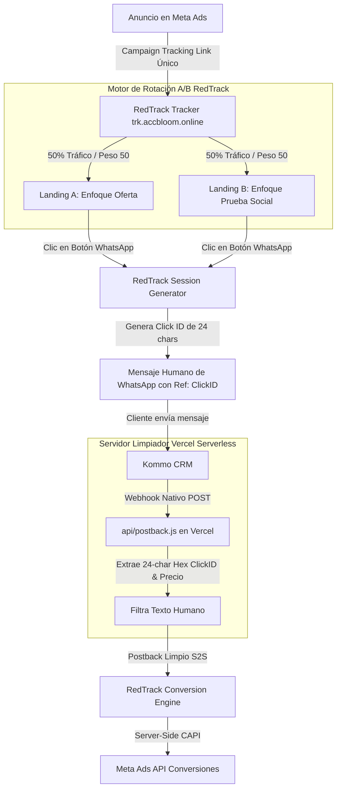

# 📘 Manual de Operaciones Estándar (SOP) & Guía de Implementación
## Creación, Despliegue, A/B Testing (Split URL) y Tracking de Landings
### Stack: RedTrack + Meta Pixel + WhatsApp + Kommo CRM + GitHub + Vercel

Este manual detalla el **proceso secuencial y estandarizado de inicio a fin** para crear, desplegar, rotar mediante **Split URL A/B Testing** y medir con precisión las conversiones de tus páginas de aterrizaje hacia WhatsApp y CRM.

---

## 🏗️ 1. Arquitectura del Flujo de Tráfico y Split Testing



---

## 📐 2. Configuración Universal para Clientes (Fabri, Favio, etc.)

### 🌐 Endpoints Universales de Vercel (Reutilizables para cualquier cliente):

- **Evento Lead (Lead Recibido):**
  `https://sitecreatorbloom.vercel.app/api/postback?type=Lead`
- **Evento InitiateCheckout (Datos de Pago Enviados / CBU Enviado):**
  `https://sitecreatorbloom.vercel.app/api/postback?type=InitiateCheckout`
- **Evento Purchase (Depósito Confirmado con valor dinámico):**
  `https://sitecreatorbloom.vercel.app/api/postback?type=Purchase`

---

## 📊 3. Clientes Configurados y Validados en Producción

### 👤 Cliente 1: Fabri
- **Landings:**
  - Versión 1 (Clara): `https://sitecreatorbloom.vercel.app/landing_fabri.html`
  - Versión 2 (Oscura - Bono 20%): `https://sitecreatorbloom.vercel.app/landing_fabri_v2.html`
- **Meta Pixel ID Principal:** `3319413524888816`
- **Meta Pixel ID Adicional:** `2553053191822433`
- **RedTrack Campaign ID:** `6a86230a706cfa38ad712954`
- **Kommo Account:** `suzydiazrojas.kommo.com`
- **Oferta:** +20% Extra en carga
- **Status:** 100% Validado (`Lead`, `InitiateCheckout`, `Purchase`).

### 👤 Cliente 2: Favio
- **Landings:**
  - Versión 1 (Clara): `https://sitecreatorbloom.vercel.app/landing_fa.html`
  - Versión 2 (Oscura - Bono 100%): `https://sitecreatorbloom.vercel.app/landing_fa_v2.html`
- **Meta Pixel ID:** `1279024090875797`
- **RedTrack Campaign ID:** `6a850eede10af64050c0ae2d`
- **Kommo Account:** `suportecassino365.kommo.com`
- **Oferta:** +100% Extra en carga
- **Status:** 100% Validado (`Lead`, `InitiateCheckout`, `Purchase`).

### 👤 Cliente 3: Jessia
- **Landing:** `https://sitecreatorbloom.vercel.app/landing_jessia.html`
- **Meta Pixel ID:** `3470105516489683`
- **Status:** Requiere validación de Webhook en Kommo CRM y plantilla de mensaje RedTrack.

---

### ⚠️ Regla Obligatoria de Validación de Pixel y Tracking Base en Creación de Clientes:
> **IMPORTANTE:** Al crear o duplicar una landing para un nuevo cliente:
> 1. Confirmar explícitamente el **Meta Pixel ID** propio del cliente.
> 2. Comparar el Pixel ID recibido contra la lista de clientes activos para verificar si coincide con alguno existente o si es completamente nuevo.
> 3. NUNCA arrastrar el Pixel ID de otro cliente por defecto en la plantilla HTML ni en el script CAPI.
> 4. **Microsoft Clarity:** Toda landing debe incluir el script base de Microsoft Clarity (`y7haktxy1r`) en la etiqueta `<head>`:
>    ```html
>    <!-- Microsoft Clarity -->
>    <script type="text/javascript">
>        (function(c,l,a,r,i,t,y){
>            c[a]=c[a]||function(){(c[a].q=c[a].q||[]).push(arguments)};
>            t=l.createElement(r);t.async=1;t.src="https://www.clarity.ms/tag/"+i;
>            y=l.getElementsByTagName(r)[0];y.parentNode.insertBefore(t,y);
>        })(window, document, "clarity", "script", "y7haktxy1r");
>    </script>
>    ```

---

## 🎯 4. Regla Estándar de Tracking: Meta Pixel Frontend vs. S2S CAPI Backend

### 🚨 Regla Obligatoria para Evitar Disparidad de Conversiones
1. **Frontend (Navegador / HTML):**
   - En el evento `onclick` de los botones de WhatsApp (tanto principal como barra flotante), **ÚNICAMENTE** se debe disparar el evento `Contact`:
     ```html
     onclick="if(typeof fbq === 'function') { fbq('track', 'Contact'); }"
     ```
   - **NUNCA** incluir `fbq('track', 'Lead')` en el frontend, ya que esto cuenta cada clic en la web como un lead, generando falsos positivos cuando el usuario no envía el mensaje en WhatsApp.

2. **Backend (Server-Side / S2S CAPI):**
   - El evento `Lead` real es gestionado **exclusivamente por Server-Side CAPI** vía RedTrack cuando Kommo CRM recibe el primer mensaje de WhatsApp del cliente y envía el webhook a `api/postback.js`.
   - De esta forma, el conteo en Meta Ads reflejará exactamente los leads reales registrados en el CRM.

---

## 🔗 5. Configuración de Meta Conversions API (CAPI) en RedTrack

Para que RedTrack reenvíe automáticamente las conversiones reales enviadas desde Kommo CRM hacia Meta Ads sin depender del navegador del usuario, se debe configurar la integración CAPI en RedTrack:

### 🛠️ 1. Obtener Token de CAPI en Meta Business Manager:
1. Ir a **Meta Events Manager (Administrador de Eventos)** ➔ Seleccionar el Pixel del cliente.
2. Ir a la pestaña **Configuración (Settings)** y desplazarse hasta **API de Conversiones (Conversions API)**.
3. En la sección *Configurar conexión directa*, hacer clic en **Generar Token de Acceso (Generate Access Token)**.
4. Copiar y guardar el token alfanumérico largo generado.

### ⚙️ 2. Activar la Integración CAPI en RedTrack (Un Solo Traffic Channel + Múltiples Píxeles):
RedTrack permite gestionar múltiples clientes con un solo Traffic Channel mediante **Edit Channel ➔ CAPI Meta settings**:

1. En RedTrack, ir a **Traffic Channels** ➔ Editar el canal principal (**Meta Ads**).
2. Desplazarse a la sección **CAPI Meta settings**:
   * Mediante el botón **`+ Add Pixel`**, se pueden agregar múltiples píxeles en el mismo canal (ej. Pixel `Favio` y Pixel `Capi Fabri`).
3. Al hacer clic en editar cada Pixel (icono de lápiz ✏️ ➔ pestaña **OFFERS**):
   * **Pixel Favio** (`1279024090875797`): Vincular la oferta `Landing/WhatsApp Favio`.
   * **Pixel Capi Fabri** (`3319413524888816`): Vincular la oferta `Landing/WhatsApp Fabri`.
   * **Pixel Jessia** (`3470105516489683`): Vincular la oferta `WhatsApp Direct - Jessia`.
4. Hacer clic en **SAVE CHANGES** en el canal.
5. De esta manera, RedTrack gestiona todos los clientes en un solo canal centralizado sin cruzar datos.

---

## 📌 Flujo Completo de Asociación CAPI en RedTrack:

```
Webhook Kommo CRM (al enviar mensaje de WhatsApp)
       │
       ▼
api/postback.js en Vercel (extrae ClickID de 24 chars)
       │
       ▼
Postback S2S a RedTrack (trk.accbloom.online/postback?clickid=...)
       │
       ▼
RedTrack identifica a qué CAMPAÑA pertenece ese ClickID
       │
       ▼
RedTrack toma el CANAL DE TRÁFICO de esa campaña (ej. "Meta Ads - Favio")
       │
       ▼
RedTrack envía el evento CAPI a Meta usando el Pixel ID y Token de ese Canal
```


