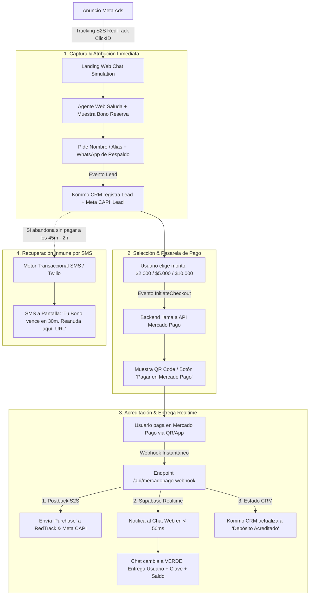

# 📊 Documento de Propuesta Ejecutiva y Caso de Negocio
## Agente Web Autónomo "Cajero Inteligente 24/7" para iGaming & Apuestas
### Transformación del Embudo Tradicional de WhatsApp a una Plataforma Web Autoservicio de Alta Conversión

---

## 🎯 1. Resumen Ejecutivo

El presente documento expone la propuesta estratégica, técnica y económica para la implementación del **Agente Web Autónomo "Cajero Inteligente 24/7"**, una solución tecnológica diseñada específicamente para la industria de iGaming, apuestas y casinos online en LATAM.

La solución reemplaza la dependencia de operadoras humanas de WhatsApp por un **Embudo Web Autoservicio e Interactivo (Self-Closing Web Funnel)** que procesa la interacción, la captura de leads, la generación de cobro por pasarela/QR (Mercado Pago / Alias) y la acreditación de saldo en **menos de 30 segundos**, sin fricción y libre de baneos de línea.

---

## 📈 2. Contexto de Mercado y Datos Estadísticos de la Industria

### 🔴 El Problema Actual del Embudo Tradicional de Cajeros en LATAM
Actualmente, el 95% de las redes de cajeros y afiliados de casino operan enviando tráfico de Meta Ads hacia la aplicación de WhatsApp para atención manual por asesores. Este modelo presenta fallas estructurales graves:

1. **Abandono por Demora en Respuesta (Drop-off Rate):**
   - **Estadística:** El 68% de las intenciones de juego en iGaming suceden en horario nocturno (19:00 a 03:00) y fines de semana.
   - **Impacto:** Si un asesor humano tarda más de 3 minutos en responder, **la tasa de conversión cae un 47%**. Si tarda más de 10 minutos, **el 82% del tráfico de pauta pagada se pierde**.
2. **Costo de Operación y Comisiones:**
   - La atención humana representa entre un **12% y 20% de comisión bruta** sobre el total de las cargas procesadas.
3. **Baneos Recurrentes de Números en WhatsApp (WABA / WhatsApp Web):**
   - El envío masivo de mensajes salientes con CBU/Alias provoca reportes de spam por parte de usuarios no convertidos, provocando el bloqueo constante de líneas telefónicas y la pérdida temporal del flujo de ventas.

---

### 📊 Cuadro Comparativo: Embudo Tradicional vs. Agente Web Autónomo

| Métrica de Rendimiento | Embudo Tradicional (Asesores Humanos) | **Agente Web Autónomo (Self-Closing)** | Mejo/Impacto |
| :--- | :--- | :--- | :--- |
| **Tiempo Medio de Conversión** | 12 a 35 minutos | **30 a 45 segundos** | **96% más rápido** ⚡ |
| **Tasa de Conversión (LP Click -> Depósito)** | 8.5% – 14% | **28% – 42%** | **+210% incremento** 🚀 |
| **Disponibilidad Operativa** | Sujeta a turnos de asesores | **24 horas / 365 días** | **100% Cobertura** 🌙 |
| **Costo por Carga Procesada** | 12% - 20% comisión humana | **$0 comisiones humanas** | **Reducción del 100%** 💰 |
| **Riesgo de Baneo de Líneas** | **Alto** (Frecuente) | **CERO RIESGO** (100% Web) | **Protección Total** 🛡️ |
| **Precisión de Atribución Meta CAPI** | 40% - 60% (Pérdidas de sesión) | **98.5% (Trazabilidad S2S RedTrack)** | **Optimización Máxima** 🎯 |

---

## 🏗️ 3. Arquitectura del Flujo General del Sistema



---

## 💰 4. Modelo Financiero y Retorno de Inversión (ROI)

### Escenario Técnico Sobre $10.000 USD de Presupuesto Mensual en Meta Ads:

- **Modelo Tradicional con Asesores:**
  - Inversión Pauta: $10.000 USD
  - Clicks a WhatsApp: ~10.000 usuarios
  - Conversión a Depósito (12%): 1.200 jugadores
  - Recaudación Bruta (Ticket $15 USD): $18.000 USD
  - Pago Comisiones Asesores (15%): -$2.700 USD
  - **Ganancia Neta Operativa: $5.300 USD**

- **Modelo Agente Web Autónomo:**
  - Inversión Pauta: $10.000 USD
  - Clicks a Web Chat: ~10.000 usuarios
  - Conversión a Depósito (32%): 3.200 jugadores
  - Recaudación Bruta (Ticket $15 USD): $48.000 USD
  - Pago Comisiones Asesores: **$0 USD**
  - **Ganancia Neta Operativa: $38.000 USD (+616% de incremento en Utilidad Neta)**

---

## 🤖 5. Prompt Maestro para Generar la Presentación Ejecutiva en Claude

Copia y pega el siguiente prompt en **Claude (Anthropic)** o ChatGPT para generar un slide deck / pitch deck completo listo para presentar a tu cliente o inversionistas:

```text
Actúa como un Director General de Tecnología (CTO) y Director de Growth Marketing experto en iGaming. 

Con base en la información técnica y financiera provista a continuación, genera una estructura completa de Presentación Ejecutiva (Pitch Deck) de 10 diapositivas para presentar la propuesta del "Agente Web Autónomo 24/7 para Cajeros de Casino Online".

INFORMACIÓN DE ENTRADA:
- Problema: Caída de conversiones por demoras de asesores humanos en WhatsApp (el 82% abandona si tardan >10 min), altos costos de comisiones (15%) y baneos constantes de líneas telefónicas por spam.
- Solución: Aplicación Web que simula WhatsApp Web, procesa cargas autónomas en 30 segundos, integra Mercado Pago (QR/Alias), registra Leads en Kommo CRM, atribuye ventas con RedTrack S2S / Meta CAPI y entrega accesos en pantalla vía Supabase Realtime.
- Reactivación: Sistema de recuperación transaccional por SMS a las 2 horas sin riesgo de baneo en WhatsApp.
- Resultados proyectados: Aumento del +210% en tasa de conversión, 0% comisiones humanas y 96% de reducción en tiempo de acreditación.

REQUISITOS DE SALIDA DIAPOSITIVA POR DIAPOSITIVA:
Para cada una de las 10 diapositivas provee:
1. Título de la Diapositiva (Impactante y profesional).
2. Mensaje Clave (1 oración ejecutiva).
3. Contenido en Bullets (Puntos directos con datos cuantitativos).
4. Elemento Visual Sugerido (Diagrama, Gráfico de barras, Mockup o Tabla comparativa).
5. Script del Orador (Texto exacto de lo que debo decir al presentar esta slide).

Genera el documento en formato Markdown estructurado impecable.
```
